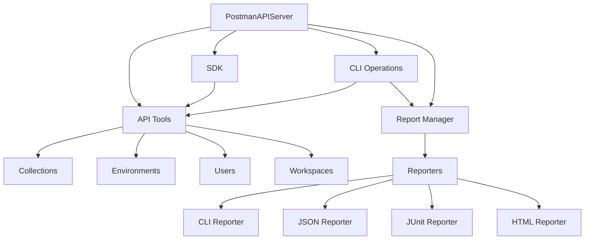

# Postman API & CLI MCP Server Design Document

Note see `cline_task_dec-17-2024_6-25-08-pm.md` for latest discussion on the design.

## 1. Overview

This document outlines the design for integrating Postman CLI capabilities into the existing Postman API MCP server. The design leverages the existing API infrastructure while adding CLI-specific functionality.

## 2. System Architecture

### 2.1 Core Components

```
postman-api-server/
├── src/
│   ├── index.ts                # Entry point
│   ├── server.ts               # Main server implementation
│   ├── types.ts                # Shared type definitions
│   ├── tools/                  # API operation tools
│   │   ├── api/                # API-specific operations
│   │   │   ├── collections.ts  # Collection operations (CRUD, forking, etc.)
│   │   │   ├── environments.ts # Environments & variables
│   │   │   ├── users.ts        # Auth & user management
│   │   │   └── workspaces.ts
│   │   └── cli/               # CLI operations
│   │       ├── commands.ts    # Main CLI functionality
│   │       └── session.ts     # CLI session management
│   └── reporting/             # Reporting system
│       ├── reporters/
│       │   ├── base.ts
│       │   ├── cli.ts
│       │   ├── json.ts
│       │   ├── junit.ts
│       │   └── html.ts
│       ├── factory.ts         # Reporter factory (config-based)
│       └── manager.ts         # Reporting logistics
```


### 2.2 Key Design Decisions

1. **Separation of Concerns**
   - API operations remain isolated in `tools/`
   - CLI-specific logic contained in `cli/`
   - Reporting system modularized in `reporting/`

2. **Pattern Usage**
   - Factory Pattern for reporter creation
   - Strategy Pattern for different report types
   - Singleton Pattern for session management

3. **Extensibility**
   - New reporters can be added by extending base reporter
   - New CLI operations can be added without modifying API tools
   - New report formats can be supported through factory extension


### 2.3 Component Relationships




## 3. Core Functionality

### 3.1 API Operations (Existing)
```typescript
interface ToolHandler {
  getToolDefinitions(): ToolDefinition[];
  handleToolCall(name: string, args: unknown): Promise<ToolCallResponse>;
}

class CollectionTools implements ToolHandler {
  // Existing implementation for API operations
}
```

### 3.2 CLI Operations (New)
```typescript
class CLIOperations implements ToolHandler {
  getToolDefinitions(): ToolDefinition[] {
    return [
      {
        name: 'cli_login',
        description: 'Authenticate with Postman API key',
        inputSchema: {/* schema */}
      },
      {
        name: 'run_collection',
        description: 'Run a collection with configuration options',
        inputSchema: {/* schema */}
      },
      {
        name: 'api_lint',
        description: 'Check API definitions against governance rules',
        inputSchema: {/* schema */}
      },
      {
        name: 'publish_api',
        description: 'Publish an API version',
        inputSchema: {/* schema */}
      }
    ];
  }
}
```

## 4. Reporting System

### 4.1 Reporter Interface
```typescript
interface Reporter {
  generateReport(results: CollectionRunResult): Promise<void>;
}
```

### 4.2 Reporter Types and Options
```typescript
interface ReporterOptions {
  export?: string;
  omitRequestBodies?: boolean;
  omitResponseBodies?: boolean;
  omitHeaders?: boolean;
  omitAllHeadersAndBody?: boolean;
}

interface CliReporterOptions extends ReporterOptions {
  silent?: boolean;
  showTimestamps?: boolean;
  noSummary?: boolean;
  noFailures?: boolean;
  noAssertions?: boolean;
  noSuccessAssertions?: boolean;
  noConsole?: boolean;
  noBanner?: boolean;
}

interface JsonReporterOptions extends ReporterOptions {
  structure?: 'native' | 'newman';
}
```

### 4.3 Report Management
```typescript
class ReportManager {
  constructor(config: ReportingConfiguration) {
    this.initializeReporters(config);
  }

  async generateReports(results: CollectionRunResult): Promise<void> {
    await Promise.all(
      this.reporters.map(reporter => reporter.generateReport(results))
    );
  }
}
```

## 5. Integration Points

### 5.1 CLI to API Integration
```typescript
class CLIOperations {
  constructor(
    private collectionTools: CollectionTools,
    private environmentTools: EnvironmentTools,
    private reportManager: ReportManager
  ) {}

  async runCollection(args: RunCollectionArgs): Promise<void> {
    // 1. Use API tools to fetch resources
    const collection = await this.collectionTools.getCollection(args.collection);
    const environment = args.environment
      ? await this.environmentTools.getEnvironment(args.environment)
      : undefined;

    // 2. Execute collection
    const results = await this.executeCollection(collection, environment, args.options);

    // 3. Generate reports
    await this.reportManager.generateReports(results);
  }
}
```

### 5.2 Authentication Flow
```typescript
class SessionManager {
  async login(apiKey: string): Promise<void> {
    // Validate API key
    await this.validateApiKey(apiKey);
    // Store for session
    await this.storeCredentials(apiKey);
  }

  async logout(): Promise<void> {
    await this.clearCredentials();
  }
}
```

## 6. Configuration

### 6.1 Environment Variables
```typescript
interface ServerConfig {
  POSTMAN_API_KEY: string;
  CLI_WORKING_DIR?: string;
  REPORT_OUTPUT_DIR?: string;
}
```

### 6.2 Reporter Configuration
```typescript
interface ReportingConfiguration {
  reporters: ('cli' | 'json' | 'junit' | 'html')[];
  cliOptions?: CliReporterOptions;
  jsonOptions?: JsonReporterOptions;
  junitOptions?: ReporterOptions;
  htmlOptions?: ReporterOptions;
  globalOptions?: ReporterOptions;
}
```

## 7. Error Handling

### 7.1 Error Types
```typescript
enum ErrorCode {
  AuthenticationError = 'AUTHENTICATION_ERROR',
  ValidationError = 'VALIDATION_ERROR',
  ExecutionError = 'EXECUTION_ERROR',
  ReportingError = 'REPORTING_ERROR'
}

class PostmanError extends Error {
  constructor(
    public code: ErrorCode,
    message: string,
    public details?: unknown
  ) {
    super(message);
  }
}
```

### 7.2 Error Handling Strategy
```typescript
class ErrorHandler {
  handle(error: unknown): ToolCallResponse {
    if (error instanceof PostmanError) {
      return this.handlePostmanError(error);
    }
    if (axios.isAxiosError(error)) {
      return this.handleApiError(error);
    }
    return this.handleUnknownError(error);
  }
}
```

## 8. Implementation Strategy

1. Phase 1: Core CLI Integration
   - Implement CLIOperations class
   - Add session management
   - Basic collection running

2. Phase 2: Reporting System
   - Implement base Reporter class
   - Add all reporter types
   - Implement ReportManager

3. Phase 3: Advanced Features
   - API governance checking
   - Version publishing
   - Advanced collection running options

4. Phase 4: Testing & Documentation
   - Unit tests for all components
   - Integration tests
   - API documentation updates

This design provides a comprehensive framework for integrating Postman CLI functionality while maintaining the existing API capabilities and ensuring clean separation of concerns.

## 9. Conclusion


The MCP wrapper for Postman tools makes sense primarily as an AI interaction layer for complex, multi-step operations where structure and safety are paramount. However, it may be overengineered for simple operations where direct CLI or API usage would suffice. The MCP wrapper provides most value when:

1. **Complex Operations**
- Managing multiple collections
- Coordinating environments
- Generating comprehensive reports

1. **AI-Driven Automation**
- Automated testing workflows
- API documentation maintenance
- Environment management

1. **Error-Sensitive Operations**
- Critical API testing
- Production deployments
- Compliance checking

It provides less value for:

1. **Simple Operations**
- Basic collection runs
- Single API calls
- Quick environment checks

2. **Direct CLI Usage**
- Developer-driven operations
- Local testing
- Quick iterations
