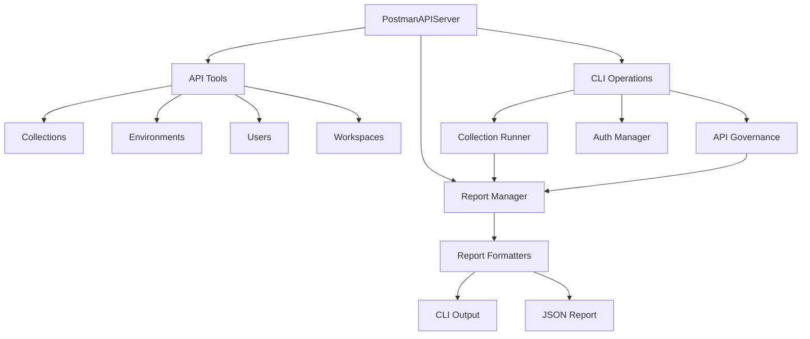

# Postman API & CLI MCP Server Design Document

## 1. Overview

This document outlines the design for integrating Postman CLI capabilities into the existing Postman API MCP server. The design leverages the existing API infrastructure while adding CLI-specific functionality to enable automated collection runs, API governance checks, and authentication management.

## 2. System Architecture

### 2.1 Core Components

```
postman-api-server/
├── src/
│   ├── index.ts                # Entry point
│   ├── server.ts               # Main server implementation
│   ├── types.ts                # Shared type definitions
│   ├── tools/                  # API operation tools
│   │   ├── api/                # API-specific operations
│   │   │   ├── collections.ts  # Collection operations
│   │   │   ├── environments.ts # Environments & variables
│   │   │   ├── users.ts        # Auth & user management
│   │   │   └── workspaces.ts   # Workspace operations
│   │   └── cli/               # CLI operations
│   │       ├── runner.ts      # Collection runner functionality
│   │       ├── governance.ts  # API governance checks
│   │       └── auth.ts        # CLI authentication
│   └── reporting/             # Test run reporting
       ├── formatters/
       │   ├── cli.ts         # CLI output formatter
       │   └── json.ts        # JSON report formatter
       └── manager.ts         # Report generation manager
```

### 2.2 Key Design Decisions

1. **Separation of Concerns**
   - API operations remain isolated in `tools/api/`
   - CLI-specific logic contained in `tools/cli/`
   - Simplified reporting system focused on CLI and JSON output

2. **Pattern Usage**
   - Strategy Pattern for report formats
   - Singleton Pattern for CLI auth management
   - Factory Pattern for report formatter creation

3. **Extensibility**
   - New CLI commands can be added without modifying API tools
   - Additional report formats can be supported through new formatters
   - API governance rules configurable via external files

### 2.3 Component Relationships



## 3. Core Functionality

### 3.1 CLI Operations

```typescript
class CLIOperations implements ToolHandler {
  getToolDefinitions(): ToolDefinition[] {
    return [
      {
        name: 'cli_login',
        description: 'Sign in to Postman CLI using an API key',
        inputSchema: {
          type: 'object',
          properties: {
            apiKey: {
              type: 'string',
              description: 'Postman API key'
            }
          },
          required: ['apiKey']
        }
      },
      {
        name: 'cli_logout',
        description: 'Sign out from Postman CLI',
        inputSchema: {
          type: 'object',
          properties: {},
          required: []
        }
      },
      {
        name: 'run_collection',
        description: 'Run a collection with configuration',
        inputSchema: {
          type: 'object',
          properties: {
            collection: {
              type: 'string',
              description: 'Collection ID, URL, or local file path'
            },
            environment: {
              type: 'string',
              description: 'Environment ID, URL, or local file path'
            },
            folder: {
              type: 'string',
              description: 'Specific folder to run'
            },
            iterations: {
              type: 'number',
              description: 'Number of iterations to run'
            },
            delay: {
              type: 'number',
              description: 'Delay between requests in ms'
            },
            timeout: {
              type: 'number',
              description: 'Request timeout in ms'
            },
            reportPath: {
              type: 'string',
              description: 'Path to save the run report'
            },
            format: {
              type: 'string',
              enum: ['cli', 'json'],
              description: 'Report format'
            },
            bail: {
              type: 'boolean',
              description: 'Stop on first test failure'
            },
            suppressExitCode: {
              type: 'boolean',
              description: 'Always exit with code 0'
            }
          },
          required: ['collection']
        }
      },
      {
        name: 'api_lint',
        description: 'Check API definitions against governance rules',
        inputSchema: {
          type: 'object',
          properties: {
            api: {
              type: 'string',
              description: 'API ID, URL, or local definition file'
            },
            ruleset: {
              type: 'string',
              description: 'Governance ruleset name or path'
            },
            reportPath: {
              type: 'string',
              description: 'Path to save the lint report'
            }
          },
          required: ['api']
        }
      },
      {
        name: 'contract_test',
        description: 'Run contract tests for an API',
        inputSchema: {
          type: 'object',
          properties: {
            api: {
              type: 'string',
              description: 'API ID, URL, or local definition file'
            },
            collection: {
              type: 'string',
              description: 'Contract test collection ID or file'
            },
            environment: {
              type: 'string',
              description: 'Environment ID or file path'
            },
            reportPath: {
              type: 'string',
              description: 'Path to save the test report'
            }
          },
          required: ['api', 'collection']
        }
      }
    ];
  }
}
```


### 3.2 Collection Runner

```typescript
class CollectionRunner {
  async runCollection(args: RunCollectionArgs): Promise<RunResult> {
    // 1. Validate and load collection
    const collection = await this.loadCollection(args.collection);

    // 2. Set up environment if provided
    const environment = args.environment
      ? await this.loadEnvironment(args.environment)
      : undefined;

    // 3. Configure run options
    const options = {
      folder: args.folder,
      iterations: args.iterations,
      delay: args.delay,
      timeout: args.timeout,
      bail: args.bail,
      suppressExitCode: args.suppressExitCode
    };

    // 4. Execute collection run
    const results = await this.executeRun(collection, environment, options);

    // 5. Generate report
    const report = await this.reportManager.generateReport(results, {
      format: args.format || 'cli',
      reportPath: args.reportPath
    });

    return {
      success: results.failures === 0,
      summary: results.summary,
      report
    };
  }

  private async loadCollection(source: string): Promise<Collection> {
    if (this.isLocalFile(source)) {
      return this.loadLocalCollection(source);
    }
    if (this.isCollectionId(source)) {
      return this.loadRemoteCollection(source);
    }
    if (this.isUrl(source)) {
      return this.loadCollectionFromUrl(source);
    }
    throw new CLIError(
      CLIErrorCode.ValidationError,
      'Invalid collection source'
    );
  }

  private async loadEnvironment(source: string): Promise<Environment> {
    if (this.isLocalFile(source)) {
      return this.loadLocalEnvironment(source);
    }
    if (this.isEnvironmentId(source)) {
      return this.loadRemoteEnvironment(source);
    }
    if (this.isUrl(source)) {
      return this.loadEnvironmentFromUrl(source);
    }
    throw new CLIError(
      CLIErrorCode.ValidationError,
      'Invalid environment source'
    );
  }
}
```

### 3.3 Contract Testing

```typescript
class ContractTester {
  async runContractTests(args: ContractTestArgs): Promise<TestResult> {
    // 1. Load API definition
    const api = await this.loadAPIDefinition(args.api);

    // 2. Load contract test collection
    const tests = await this.loadCollection(args.collection);

    // 3. Set up environment if provided
    const environment = args.environment
      ? await this.loadEnvironment(args.environment)
      : undefined;

    // 4. Execute contract tests
    const results = await this.executeTests(api, tests, environment);

    // 5. Generate report
    const report = await this.reportManager.generateReport(results, {
      format: 'json',
      reportPath: args.reportPath
    });

    return {
      success: results.failures === 0,
      violations: results.violations,
      summary: results.summary,
      report
    };
  }
}
```

### 3.4 API Governance

```typescript
class APIGovernance {
  async lintAPI(args: LintAPIArgs): Promise<LintResult> {
    // 1. Load API definition
    const api = await this.loadAPIDefinition(args.api);

    // 2. Load ruleset
    const ruleset = await this.loadRuleset(args.ruleset);

    // 3. Run governance checks
    const violations = await this.checkRules(api, ruleset);

    return {
      success: violations.length === 0,
      violations,
      summary: this.generateSummary(violations)
    };
  }
}
```


## 4. Authentication Management

```typescript
class AuthManager {
  private static instance: AuthManager;
  private apiKey: string | null = null;

  private constructor() {}

  static getInstance(): AuthManager {
    if (!AuthManager.instance) {
      AuthManager.instance = new AuthManager();
    }
    return AuthManager.instance;
  }

  async login(apiKey: string): Promise<void> {
    // 1. Validate API key format
    this.validateApiKeyFormat(apiKey);

    // 2. Test API key with a simple API call
    await this.testApiKey(apiKey);

    // 3. Store API key securely
    this.apiKey = apiKey;
  }

  async logout(): Promise<void> {
    this.apiKey = null;
  }

  getApiKey(): string {
    if (!this.apiKey) {
      throw new CLIError(
        CLIErrorCode.AuthenticationError,
        'Not authenticated. Please login first.'
      );
    }
    return this.apiKey;
  }
}
```

## 5. Reporting System

### 5.1 Report Formatters

```typescript
interface ReportFormatter {
  format(results: RunResult): Promise<string>;
}

class CLIFormatter implements ReportFormatter {
  async format(results: RunResult): Promise<string> {
    // Format results for CLI output with colors and formatting
    return this.formatCLIOutput(results);
  }
}

class JSONFormatter implements ReportFormatter {
  async format(results: RunResult): Promise<string> {
    // Format results as structured JSON
    return JSON.stringify(results, null, 2);
  }
}
```

### 5.2 Report Manager

```typescript
class ReportManager {
  private formatters: Map<string, ReportFormatter>;

  constructor() {
    this.formatters = new Map([
      ['cli', new CLIFormatter()],
      ['json', new JSONFormatter()]
    ]);
  }

  async generateReport(
    results: RunResult,
    options: ReportOptions
  ): Promise<string> {
    const formatter = this.formatters.get(options.format);
    if (!formatter) {
      throw new Error(`Unsupported format: ${options.format}`);
    }

    const report = await formatter.format(results);

    if (options.exportPath) {
      await this.exportReport(report, options.exportPath);
    }

    return report;
  }
}
```

## 6. Error Handling

```typescript
enum CLIErrorCode {
  AuthenticationError = 'CLI_AUTH_ERROR',
  CollectionNotFound = 'COLLECTION_NOT_FOUND',
  EnvironmentNotFound = 'ENVIRONMENT_NOT_FOUND',
  ExecutionError = 'EXECUTION_ERROR',
  ValidationError = 'VALIDATION_ERROR'
}

class CLIError extends Error {
  constructor(
    public code: CLIErrorCode,
    message: string,
    public details?: unknown
  ) {
    super(message);
  }
}

class ErrorHandler {
  handle(error: unknown): ToolCallResponse {
    if (error instanceof CLIError) {
      return this.handleCLIError(error);
    }
    if (axios.isAxiosError(error)) {
      return this.handleAPIError(error);
    }
    return this.handleUnknownError(error);
  }
}
```

## 7. Implementation Strategy

1. Phase 1: Core Authentication & File Operations
   - Implement CLI login/logout
   - Add secure API key management
   - Implement local file loading capabilities
   - Set up error handling

2. Phase 2: Collection Runner
   - Basic collection execution
   - Support for local and remote collections
   - CLI output formatting
   - JSON report generation

3. Phase 3: Contract Testing & API Governance
   - API definition loading
   - Contract test execution
   - Rule checking implementation
   - Violation reporting

4. Phase 4: Testing & Documentation
   - Unit tests for all components
   - Integration tests
   - CLI usage documentation

## 8. Conclusion

This design provides a comprehensive implementation of Postman CLI functionality through the MCP server. It prioritizes the core features while maintaining flexibility for future extensions.

Key benefits of this design:

1. **Complete CLI Feature Support**
   - Collection running from multiple sources
   - Contract testing capabilities
   - API governance checking
   - Local file operations

2. **Robust Architecture**
   - Clear separation of concerns
   - Flexible source loading
   - Comprehensive error handling
   - Extensible reporting system

3. **User-Friendly Integration**
   - Matches CLI command structure
   - Support for local and remote resources
   - Detailed reporting options
   - Consistent error handling

This implementation provides a solid foundation for integrating Postman CLI capabilities while maintaining the flexibility to add more features as needed.
